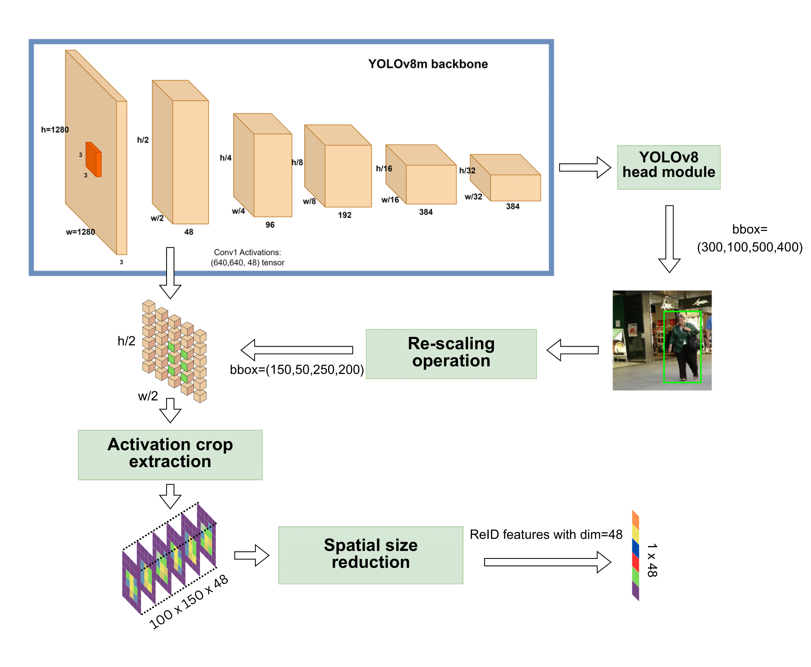

# LITE: A Paradigm Shift in Multi-Object Tracking with Efficient ReID Feature Integration

> [**LITE: A Paradigm Shift in Multi-Object Tracking with Efficient ReID Feature Integration**](http://www.arxiv.org/abs/2409.04187v2)
> 
> Jumabek Alikhanov, Dilshod Obidov, Hakil Kim
> 
> *[arXiv 2409.04187](http://www.arxiv.org/abs/2409.04187v2)*
> 
> **
> 
> Download the full paper from this repo: [docs/LITE.pdf](docs/LITE.pdf)
>
> Keywords: multi-object tracking, MOT, object tracking, ReID, computer vision, real-time tracking, LITE, arXiv 2409.04187


# Practical Evaluation Framework for Real-Time Multi-Object Tracking: Achieving Optimal and Realistic Performance

> [**Practical Evaluation Framework for Real-Time Multi-Object Tracking: Achieving Optimal and Realistic Performance**](https://doi.org/10.1109/ACCESS.2025.3541177)  
> 
> Jumabek Alikhanov, Dilshod Obidov, Mirsaid Abdurasulov, Hakil Kim
> 
> *IEEE Access, vol. 13, pp. 34768–34788, 2025*
> 
> Download the full paper from this repo: [docs/Practical_Evaluation_Framework_for_Real-Time_Multi-Object_Tracking_Achieving_Optimal_and_Realistic_Performance.pdf](docs/Practical_Evaluation_Framework_for_Real-Time_Multi-Object_Tracking_Achieving_Optimal_and_Realistic_Performance.pdf)
>
> Keywords: Multiple object tracking (MOT), real-time tracking, evaluation framework, LITE, ReID, performance evaluation
> 
## Overview

LITE (Lightweight Integrated Tracking-Feature Extraction) introduces a groundbreaking approach to enhance ReID-based Multi-Object Tracking (MOT) systems. By integrating appearance feature extraction directly into the detection pipeline, LITE significantly improves computational efficiency while maintaining robust performance. Utilizing CNN-based object detectors like YOLOv8 and YOLO11, LITE enables real-time tracking, making it ideal for resource-constrained environments.

---


## Key Features

- **Efficient Integration**: Combines appearance feature extraction within the detection process.
- **Lightweight Design**: Tailored for real-time applications on resource-limited devices.
- **Performance Optimization**: Demonstrates notable FPS improvements across multiple trackers while retaining competitive accuracy.

---

## Experimental Results

We evaluated LITE using **YOLOv8m** with the following settings:

- **Confidence Threshold**: 0.25
- **Input Resolution**: 1280

| Tracker              | MOT17 HOTA ↑ | MOT17 FPS ↑ | MOT20 HOTA ↑ | MOT20 FPS ↑ |
|----------------------|------------------|----------------|------------------|----------------|
| DeepSORT            | 43.7            | 10.5           | 24.4            | 8.5            |
| StrongSORT          | 44.5            | 4.5            | 26.1            | 2.6            |
| Deep OC-SORT        | 43.7            | 10.3           | 24.9            | 8.9            |
| BoTSORT             | 40.8            | 10.6           | 21.1            | 9.4            |
| **LITE:DeepSORT**   | 43.0            | 26.7           | 25.2            | 15.9           |
| **LITE:StrongSORT** | 42.4            | 29.7           | 25.2            | 22.9           |
| **LITE:Deep OC-SORT** | 43.4            | 34.8           | 25.4            | 19.6           |
| **LITE:BoTSORT**    | 40.8            | 38.2           | 21.1            | 31.8           |
---

## Installation

Follow these steps to set up the LITE tracking system:

### 1. Clone the Repository

```bash
# Clone the LITE Tracker Repository
git clone https://github.com/Jumabek/LITE.git
cd LITE
```

### 2. Set Up Python Environment

```bash
# Create and activate a virtual environment
python3.10 -m venv myenv
source myenv/bin/activate

# Install dependencies
pip install -r requirements.txt
```

### 3. Clone Additional Dependencies

```bash
# Clone supplementary repositories
git clone https://github.com/Jumabek/ultralytics.git
git clone https://github.com/humblebeeintel/yolo_tracking.git
git clone https://github.com/humblebeeintel/TrackEval
```

### 4. Set Up FastReID

```bash
bash scripts/setup_fastreid.sh
```

---

## Dataset Preparation

Download the prepared datasets from [this link](https://console.cloud.google.com/storage/browser/hbai-general-data/2024/cv.lite/dataset) and organize them as follows:

```plaintext
LITE/datasets
   |-- MOT
   |   |-- train
   |   |-- test
   |-- PersonPath22
   |   |-- test
   |-- VIRAT-S
   |   |-- train
   |-- KITTI
       |-- train
       |-- test
```

---

## Checkpoints

Download the required checkpoints from [this link](https://drive.google.com/file/d/15NBT6pnwzf43MsNu1QK_qC04Efxg0yTP/view?usp=sharing) and place them under `LITE/checkpoints`:

```plaintext
checkpoints
└── FastReID
    ├── bagtricks_S50.yml
    ├── Base-bagtricks.yml
    ├── deepsort
    │   ├── ckpt.t7
    │   └── original_ckpt.t7
    └── DukeMTMC_BoT-S50.pth
```

---

## Running Experiments

### 1. Run Tracking and ReID Experiments

```bash
bash scripts/run_experiment.sh -d <DATASET> -s <SPLIT> -t <TRACKER> -m <YOLO_MODEL>
# TRACKER options: "SORT", "LITEDeepSORT", "DeepSORT", "StrongSORT", "LITEStrongSORT", "OCSORT", "Bytetrack", "DeepOCSORT", "LITEDeepOCSORT", "BoTSORT", "LITEBoTSORT"

# YOLO_MODEL options: all models of YOLO from yolov8 to yolo11
```

### 2. Running the ReID Evaluator
```bash
python reid.py --dataset <DATASET> --seq_name <SEQ_NAME>  --split <SPLIT>  --tracker <ReID_MODEL> --save
```

## Demo

Comparison of Tracker and LITE versions. Tracker can be viewed on Google Drive.
👉[

### Download demo videos

```
bash demo/download_solutions_demo_videos.sh
```

### Basic Tracking Demo

```bash
python demo.py --source demo/VIRAT_S_010204_07_000942_000989.mp4
```

### Object Counter & Heatmap

```bash
python solutions.py \
--source videos/shortened_enterance.mp4 \
--solution object_counter heatmap
```

### Parking Management

```bash
python solutions.py \
--source videos/parking.mp4 \
--solution parking_management
```

---

## Citation

If you use LITE in your research, please cite our work:

```bibtex
@misc{alikhanov2024liteparadigmshiftmultiobject,
      title={LITE: A Paradigm Shift in Multi-Object Tracking with Efficient ReID Feature Integration}, 
      author={Jumabek Alikhanov and Dilshod Obidov and Hakil Kim},
      year={2024},
      eprint={2409.04187},
      archivePrefix={arXiv},
      primaryClass={cs.CV},
      url={https://arxiv.org/abs/2409.04187}, 
}
```

```bibtex
@ARTICLE{10883969,
  author={Alikhanov, Jumabek and Obidov, Dilshod and Abdurasulov, Mirsaid and Kim, Hakil},
  journal={IEEE Access}, 
  title={Practical Evaluation Framework for Real-Time Multi-Object Tracking: Achieving Optimal and Realistic Performance}, 
  year={2025},
  volume={13},
  number={},
  pages={34768-34788},
  keywords={Tracking;Detectors;Pipelines;Training;Benchmark testing;Image edge detection;Feature extraction;Real-time systems;Cameras;Performance evaluation;Multiple object tracking (MOT);real-time tracking;evaluation framework;LITE;ReID},
  doi={10.1109/ACCESS.2025.3541177}}
```

