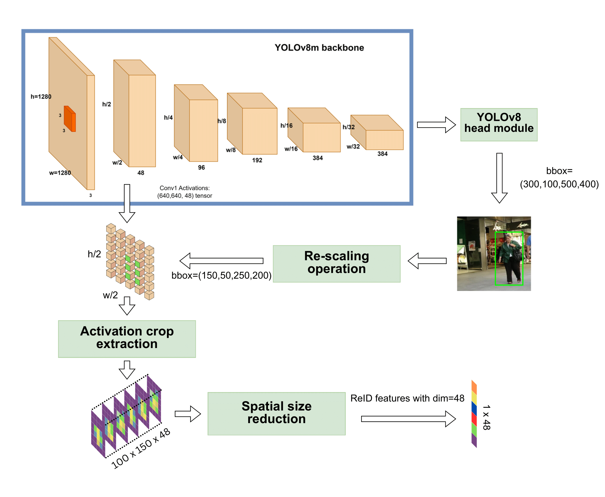

# LITE: Efficient ReID Feature Integration for Multi-Object Tracking

This repository contains the implementation used for:

- [LITE: A Paradigm Shift in Multi-Object Tracking with Efficient ReID Feature Integration](http://www.arxiv.org/abs/2409.04187v2), ICONIP 2024
- [Practical Evaluation Framework for Real-Time Multi-Object Tracking: Achieving Optimal and Realistic Performance](https://doi.org/10.1109/ACCESS.2025.3541177), IEEE Access 2025

Authors: Jumabek Alikhanov, Dilshod Obidov, Mirsaid Abdurasulov, Hakil Kim

Paper PDFs are included in [docs/LITE.pdf](docs/LITE.pdf) and [docs/Practical_Evaluation_Framework_for_Real-Time_Multi-Object_Tracking_Achieving_Optimal_and_Realistic_Performance.pdf](docs/Practical_Evaluation_Framework_for_Real-Time_Multi-Object_Tracking_Achieving_Optimal_and_Realistic_Performance.pdf).



## Overview

LITE (Lightweight Integrated Tracking-Feature Extraction) extracts appearance features directly from intermediate YOLO detector features instead of running a separate ReID network for every detection. The repository supports standard trackers and their LITE variants:

- DeepSORT and LITE-DeepSORT
- StrongSORT and LITE-StrongSORT
- Deep OC-SORT and LITE-Deep OC-SORT
- BoT-SORT and LITE-BoT-SORT
- SORT, ByteTrack, and OC-SORT baselines

The paper results use YOLOv8m, input resolution 1280, person class only, confidence threshold 0.25, and `layer14` as the default LITE appearance feature layer unless otherwise stated.

## Reported Results

| Tracker | MOT17 HOTA | MOT17 FPS | MOT20 HOTA | MOT20 FPS |
|---|---:|---:|---:|---:|
| DeepSORT | 43.7 | 10.5 | 24.4 | 8.5 |
| StrongSORT | 44.5 | 4.5 | 26.1 | 2.6 |
| Deep OC-SORT | 43.7 | 10.3 | 24.9 | 8.9 |
| BoT-SORT | 40.8 | 10.6 | 21.1 | 9.4 |
| LITE:DeepSORT | 43.0 | 26.7 | 25.2 | 15.9 |
| LITE:StrongSORT | 42.4 | 29.7 | 25.2 | 22.9 |
| LITE:Deep OC-SORT | 43.4 | 34.8 | 25.4 | 19.6 |
| LITE:BoT-SORT | 40.8 | 38.2 | 21.1 | 31.8 |

Small FPS differences are expected across GPUs, CUDA versions, storage speed, and display/visualization settings. HOTA should be compared using the same TrackEval version, dataset split, confidence threshold, input size, and tracker configuration.

## Environment

The experiments were developed for Python 3.10 with CUDA-enabled PyTorch. A clean setup is recommended:

```bash
git clone https://github.com/Jumabek/LITE.git
cd LITE

python3.10 -m venv .venv
source .venv/bin/activate
python -m pip install --upgrade pip setuptools wheel

# Choose the PyTorch wheel that matches your CUDA driver.
# This example uses CUDA 12.1.
pip install torch==2.2.2 torchvision==0.17.2 --index-url https://download.pytorch.org/whl/cu121
pip install -r requirements.txt

# Make local LITE, ultralytics, and yolo_tracking modules importable.
export PYTHONPATH="$PWD:$PWD/yolo_tracking:$PYTHONPATH"
```

If you use a different CUDA version, install the matching `torch` and `torchvision` wheels first, then run `pip install -r requirements.txt`.

## External Tools

The repository includes local copies of the modified `ultralytics` and `yolo_tracking` code. For MOT metrics, clone TrackEval next to the project code:

```bash
git clone https://github.com/JonathonLuiten/TrackEval.git
```

The evaluation commands below assume `TrackEval/` is in the repository root. If it is elsewhere, replace `TrackEval/scripts/run_mot_challenge.py` with your local path.

## Datasets

Download the prepared datasets with:

```bash
bash scripts/download_datasets_from_gdrive.sh
```

After extraction, the expected structure is:

```text
datasets/
  MOT17/
    train/MOT17-02-FRCNN/img1/...
    train/MOT17-02-FRCNN/gt/gt.txt
    test/...
  MOT20/
    train/MOT20-01/img1/...
    train/MOT20-01/gt/gt.txt
    test/...
  PersonPath22/test/...
  VIRAT-S/train/...
  KITTI/train/...
```

You can also download MOT17/MOT20 from the official MOTChallenge site and arrange the folders in the same layout.

## Checkpoints

Download and extract ReID checkpoints with:

```bash
bash scripts/prepare_checkpoints.sh
```

The expected checkpoint layout is:

```text
checkpoints/
  FastReID/
    bagtricks_S50.yml
    Base-bagtricks.yml
    DukeMTMC_BoT-S50.pth
    deepsort/
      ckpt.t7
      original_ckpt.t7
```

YOLO weights such as `yolov8m.pt` are loaded from the repository root or downloaded automatically by Ultralytics when available.

## Quick Smoke Test

Use the included video to verify the environment before running full benchmarks:

```bash
python demo.py --source demo/VIRAT_S_010204_07_000942_000989.mp4
```

This opens an OpenCV display window. Press `q` to stop. On a headless server, run the benchmark commands below instead.

## Reproducing Tracking Results

The main wrapper is [scripts/run_experiment.sh](scripts/run_experiment.sh). It writes MOT-format predictions to:

```text
results/paper/<DATASET>-<SPLIT>/<TRACKER>__input_<SIZE>__conf_<CONF>__model_<YOLO>/data/<SEQUENCE>.txt
```

Run a single paper-setting experiment:

```bash
bash scripts/run_experiment.sh \
  -d MOT20 \
  -s train \
  -t LITEStrongSORT \
  -m yolov8m \
  -r 1280 \
  -c 0.25 \
  -o results/paper
```

Run all MOT17/MOT20 trackers used in the table:

```bash
for dataset in MOT17 MOT20; do
  for tracker in DeepSORT StrongSORT DeepOCSORT BoTSORT LITEDeepSORT LITEStrongSORT LITEDeepOCSORT LITEBoTSORT; do
    bash scripts/run_experiment.sh \
      -d "$dataset" \
      -s train \
      -t "$tracker" \
      -m yolov8m \
      -r 1280 \
      -c 0.25 \
      -o results/paper
  done
done
```

Equivalent direct command for LITE-DeepSORT:

```bash
python run.py \
  --dataset MOT20 \
  --split train \
  --tracker_name LITEDeepSORT \
  --input_resolution 1280 \
  --min_confidence 0.25 \
  --appearance_feature_layer layer14 \
  --yolo_model yolov8m \
  --dir_save results/paper/MOT20-train/LITEDeepSORT__input_1280__conf_0.25__model_yolov8m
```

For BoT-SORT and Deep OC-SORT variants, the wrapper calls `yolo_tracking/tracking/run.py` with the corresponding `--tracking-method` and optional `--appearance-feature-layer layer14`.

## Evaluating HOTA, CLEAR, and IDF1

Evaluate one dataset split with TrackEval:

```bash
python TrackEval/scripts/run_mot_challenge.py \
  --BENCHMARK MOT20 \
  --SPLIT_TO_EVAL train \
  --TRACKERS_FOLDER results/paper/MOT20-train \
  --GT_FOLDER datasets/MOT20/train \
  --GT_LOC_FORMAT "{gt_folder}/{seq}/gt/gt.txt" \
  --METRICS HOTA CLEAR Identity VACE \
  --USE_PARALLEL True \
  --NUM_PARALLEL_CORES 8 \
  --OUTPUT_SUMMARY True \
  --OUTPUT_DETAILED True \
  --PLOT_CURVES True
```

For MOT17, replace `MOT20` with `MOT17` and use `results/paper/MOT17-train` plus `datasets/MOT17/train`.

TrackEval writes summary files inside each tracker result directory. Use the `HOTA`, `MOTA`, and `IDF1` columns from those summaries when comparing with the paper table.

## Measuring FPS

The benchmark commands print per-sequence speed and write `fps.csv` for the `run.py` based trackers. For a controlled FPS comparison, keep the same GPU, CUDA version, image size, confidence threshold, batch behavior, and visualization setting across all trackers.

Example single-sequence FPS run:

```bash
bash scripts/fps.sh -d MOT20 -s train -q MOT20-01
```

FPS outputs are saved below:

```text
results/<DATASET>-FPS/<SEQUENCE>/<TRACKER>__input_1280__conf_.25/fps.csv
```

## ReID Feature Evaluation

Run the ReID evaluator on one sequence:

```bash
python reid.py \
  --dataset MOT20 \
  --seq_name MOT20-01 \
  --split train \
  --tracker LITE \
  --appearance_feature_layer layer14 \
  --output_path reid_results/MOT20-01 \
  --save
```

Run all LITE layers:

```bash
bash scripts/run_reid_all_layers.sh
```

The evaluator saves ROC and similarity-distribution plots under the selected `--output_path`.

## Demo Videos and Solutions

Download extra demo videos:

```bash
bash demo/download_solutions_demo_videos.sh
```

Run object counting and heatmap demos:

```bash
python solutions.py --source videos/shortened_enterance.mp4 --solution object_counter
python solutions.py --source videos/shortened_enterance.mp4 --solution heatmap
```

Run parking management:

```bash
python solutions.py --source videos/parking.mp4 --solution parking_management
```

Outputs are written to `demo_output_videos/`.

## Troubleshooting

- `ModuleNotFoundError` for local modules: run `export PYTHONPATH="$PWD:$PWD/yolo_tracking:$PYTHONPATH"` from the repository root.
- CUDA or `faiss-gpu` installation errors: install a PyTorch/CUDA combination supported by your driver, or use a CUDA-enabled conda environment.
- Missing `TrackEval`: clone TrackEval into the repository root or update the evaluation command path.
- Missing dataset sequence: verify the exact folder names in `datasets/<DATASET>/<split>/`; MOT17 uses names such as `MOT17-02-FRCNN`.
- GUI/OpenCV errors on a server: use non-demo benchmark commands or configure a virtual display.

## Citation

```bibtex
@misc{alikhanov2024liteparadigmshiftmultiobject,
  title={LITE: A Paradigm Shift in Multi-Object Tracking with Efficient ReID Feature Integration},
  author={Jumabek Alikhanov and Dilshod Obidov and Hakil Kim},
  year={2024},
  eprint={2409.04187},
  archivePrefix={arXiv},
  primaryClass={cs.CV},
  url={https://arxiv.org/abs/2409.04187}
}
```

```bibtex
@ARTICLE{10883969,
  author={Alikhanov, Jumabek and Obidov, Dilshod and Abdurasulov, Mirsaid and Kim, Hakil},
  journal={IEEE Access},
  title={Practical Evaluation Framework for Real-Time Multi-Object Tracking: Achieving Optimal and Realistic Performance},
  year={2025},
  volume={13},
  pages={34768-34788},
  doi={10.1109/ACCESS.2025.3541177}
}
```
