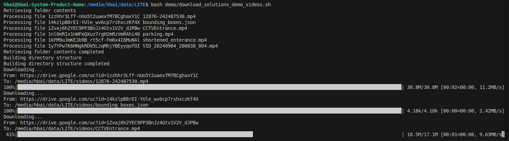

# Demo Reproduction

This folder contains a small VIRAT-S video that can be used as a smoke test after installing the repository dependencies from the root [README.md](../README.md).

## Basic LITE Tracking Demo

Run from the repository root:

```bash
python demo.py --source demo/VIRAT_S_010204_07_000942_000989.mp4
```

The script opens an OpenCV window and displays LITE tracking results. Press `q` to stop. The demo uses `yolo11m.pt`; Ultralytics downloads the weight automatically if it is not already available.

## Solution Demo Videos

Some solution demos use larger videos that are not stored directly in the repository. Download them with:

```bash
bash demo/download_solutions_demo_videos.sh
```

Then run from the repository root:

```bash
python solutions.py --source videos/shortened_enterance.mp4 --solution object_counter
python solutions.py --source videos/shortened_enterance.mp4 --solution heatmap
python solutions.py --source videos/parking.mp4 --solution parking_management
```

Generated videos are saved to:

```text
demo_output_videos/
```


